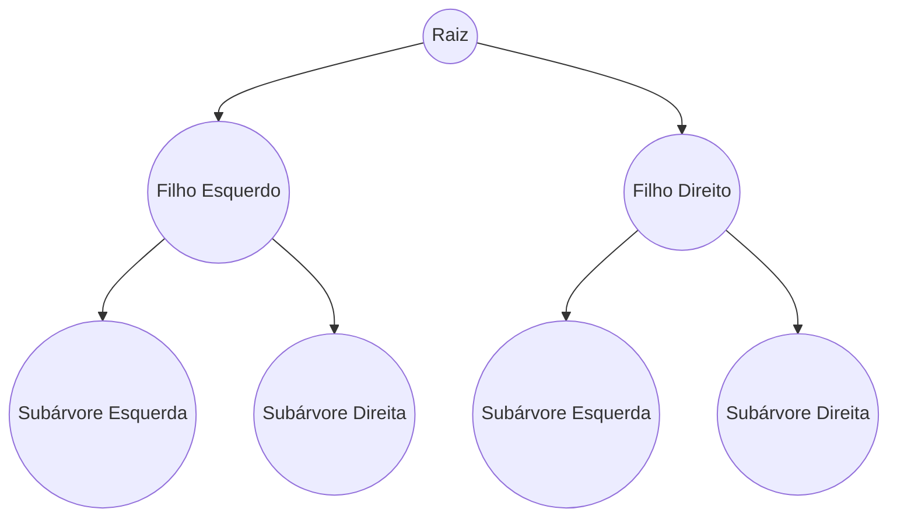

# Árvore Binária (Binary Tree)

## Definição

# Binary Tree (Árvore Binária)

Estrutura de dados hierárquica onde cada nó possui:
- No máximo dois filhos: 
  - Filho esquerdo (left child)
  - Filho direito (right child)
- Nós sem filhos são chamados de folhas (leaf nodes)

## Terminologia Básica

### Componentes
- **Raiz (Root)**: Nó superior que não possui pai
- **Folha (Leaf)**: Nó sem filhos
- **Nó Interno**: Nó com pelo menos um filho

### Métricas
- **Altura**: Número de arestas do caminho mais longo até uma folha
- **Profundidade**: Número de arestas da raiz até o nó
- **Grau**: Número de filhos diretos (máximo 2 em árvores binárias)

## Tipos de Árvores Binárias

### Por Estrutura
1. **Árvore Binária Completa**:
   - Todos os níveis exceto o último completamente preenchidos
   - Folhas devem estar mais à esquerda

2. **Árvore Binária Cheia (Full)**:
   - Todo nó possui 0 ou 2 filhos
   - Nunca apenas 1 filho

3. **Árvore Binária Perfeita**:
   - Todos os níveis completamente preenchidos
   - Todas as folhas na mesma profundidade

### Por Organização
1. **Árvore Binária de Busca (BST)**:
   - Filhos esquerdos menores que a raiz
   - Filhos direitos maiores que a raiz

2. **Heap Binário**:
   - Propriedade de heap (máximo ou mínimo na raiz)

## Percursos (Traversals)

### 1. Pré-ordem (Pre-order)
1. Visita a raiz
2. Percorre subárvore esquerda
3. Percorre subárvore direita

### 2. Em-ordem (In-order)
1. Percorre subárvore esquerda
2. Visita a raiz
3. Percorre subárvore direita

### 3. Pós-ordem (Post-order)
1. Percorre subárvore esquerda
2. Percorre subárvore direita
3. Visita a raiz

### 4. Em Nível (Level-order)
- Visita nós nível por nível
- Implementado com abordagem Breadth-First

## Aplicações

1. **Sistemas de Arquivos**: Estrutura de diretórios
2. **Bancos de Dados**: Índices em árvores balanceadas
3. **Processamento de Linguagem**: Árvores de análise sintática
4. **Inteligência Artificial**: Árvores de decisão
5. **Compactação de Dados**: Árvores de Huffman

## Complexidade

| Operação  | Caso Geral | Balanceada |
|-----------|------------|------------|
| Busca     | O(n)       | O(log n)   |
| Inserção  | O(n)       | O(log n)   |
| Exclusão  | O(n)       | O(log n)   |

## Vantagens
- Eficiência em operações quando balanceada
- Estrutura natural para representar hierarquias
- Base para estruturas mais complexas

## Limitações
- Pode degenerar para lista ligada (O(n))
- Necessidade de balanceamento para otimização